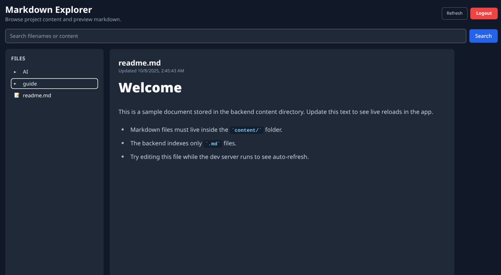

# Markdown Explorer

Markdown Explorer is a full-stack reference application for browsing a secure Markdown knowledge base.



The **Express** backend authenticates users, indexes `.md` files inside the `/content` directory, and exposes JWT-protected endpoints for tree browsing, file previews, search, and health checks. The **Vue 3 + Vite** frontend delivers a dark-themed dashboard with real-time search, an expandable file tree, and Markdown rendering powered by `marked`, `DOMPurify`, and Tailwind Typography.

---

## 📦 Project Structure

```
project/
├─ backend/        # Express API, JWT auth, markdown indexer
├─ frontend/       # Vue 3 + Vite UI with TailwindCSS
├─ content/        # Markdown documents (watched by backend)
├─ .env.example    # Sample configuration
├─ Dockerfile      # Multi-stage build for API + UI
└─ docker-compose.yml
```

---

## ✅ Prerequisites

- [Node.js](https://nodejs.org/) 18+ (Node 20 recommended)
- npm 9+
- [Docker](https://www.docker.com/) (optional for containerized runs)
- Copy `.env.example` to `.env` and adjust credentials, JWT secret, and API base URL
- Place Markdown documents under `content/`; only `.md` files are indexed

---

## 🛠 Local Development

```bash
# install shared dependencies (frontend + backend workspaces)
npm install

# launch both dev servers with hot reload
npm run dev
```

- Frontend → http://localhost:5173 *(Vite + Tailwind hot reload)*
- Backend → http://localhost:5000 *(JWT auth via `/api/login`, file routes under `/api/files`)*
- Default credentials: `admin` / `changeme` (update `.env` before production)

---

## 🐳 Docker Workflow

```bash
# build and start both containers
docker-compose up --build
```

- UI served at `http://localhost:8080` *(set `FRONTEND_PORT` in `.env` to override)*
- API available at `http://localhost:5000`
- Local `content/` directory mounted into backend for live updates

Stop everything with:

```bash
docker-compose down
```

---

## 🔧 Useful Commands

- `npm run build --workspace frontend` → build production assets
- `npm run start --workspace backend` → run Express API in production mode
- `npm install --workspace frontend` → reinstall frontend deps (e.g., after Tailwind plugin changes)

---

## 🌐 Exposing Your Local Server to the Internet
- Option A — Ngrok (fastest start)
- Option B — Cloudflare Tunnel (stable URL, free)

---

## 📄 Roadmap
- UI for mobile devices
- Access to the link

## 🩺 Troubleshooting

- Port already in use? Stop local dev servers or override `PORT` / `FRONTEND_PORT` in `.env` before rebuilding
- Docker deep-link 404s? Rebuild so nginx copies the SPA fallback config (`docker-compose up --build`)
- Search not updating while typing? Restart Vite or rebuild Docker images to pick up the latest bundle
- Front matter blocks (`--- ... ---`) inside Markdown files are stripped server-side, so only article content renders

---

## 📄 License

Released under the MIT License. See `LICENSE` for the full text.

---

_🍉_
